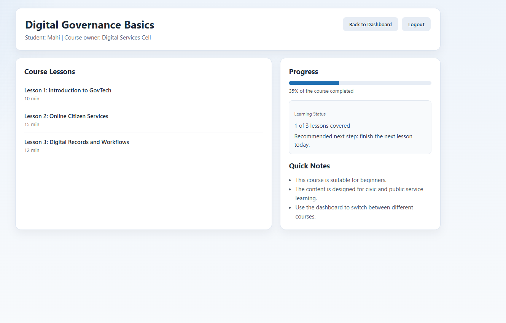

# TAP Buddy: Offline-First GovTech Learning App

Android-first React Native learning platform for The Apprentice Project (TAP), built for low-connectivity public education environments with a backend-resilient architecture.

This project combines a Frappe LMS integration layer, resilient offline sync engine, fallback mode, and real-time tutor support to keep core learning journeys usable even when networks are unstable or backend systems are temporarily unavailable.

## Why This Project Matters

Government and NGO education deployments often operate in conditions where:

- internet connectivity is intermittent or expensive
- backend systems are not always reachable
- devices are low-end and resource-constrained
- learning continuity matters more than perfect real-time availability

This app is designed around that reality. Instead of assuming a stable backend, it treats the backend as eventually available and builds around temporary failure, delayed sync, cached content, and graceful recovery.

## Problem Statement

Most mobile learning apps assume that API availability is constant and that users can wait for backend operations to succeed in real time. That assumption breaks down in many real-world GovTech deployments.

This project addresses:

- unreliable or low-bandwidth networks
- intermittent backend reachability
- offline submissions that must not be lost
- delayed synchronization and conflict handling
- the need for a usable student experience even when live services degrade

The result is an app that remains useful under failure, not only under ideal conditions.

## Key Features

### Offline-First Learning Experience

- persistent local cache for student session, course data, and DIKSHA content
- fallback mode when backend calls fail due to network, timeout, or invalid backend responses
- local-first continuity for core student flows

### Resilient Sync Engine

- persistent AsyncStorage-backed offline queue
- priority-aware sync processing with `HIGH`, `MEDIUM`, and `LOW`
- exponential backoff with adaptive retry timing
- payload validation before sync
- independent queue processing so one failed item does not block the rest
- conflict detection with server-wins and manual-review paths
- structured conflict audit trail for debugging and future admin tooling
- queue observability including retry averages, status, and priority distribution

### Backend-Resilient Runtime

- startup validation for environment and backend reachability
- API retry, timeout, deduplication, and friendly error mapping
- automatic recovery when network returns
- seamless switching between live mode and fallback mode without restart

### Real-Time Tutor Support

- WebSocket-based tutor client
- reconnect with backoff
- outbound message buffering while disconnected
- tutor typing indicator support

### Modular GovTech Architecture

- Frappe LMS integration through repository and API abstraction layers
- DIKSHA content integration behind a provider abstraction
- module gating for optional platform capabilities

## Key Design Principle

The backend is treated as eventually consistent, not always available.

That principle drives the design of:

- local persistence
- delayed sync
- retry and recovery
- graceful degradation
- fallback compatibility

The goal is not just to connect to a backend. The goal is to keep the learning product usable when the backend is slow, unreachable, or temporarily invalid.

## Architecture Overview

```text
┌───────────────────────────────────────────────────────────────┐
│                         React Native UI                      │
│   LoginScreen | DashboardScreen | CourseScreen | Feedback   │
└───────────────────────────────────────────────────────────────┘
                              │
                              ▼
┌───────────────────────────────────────────────────────────────┐
│                         Hooks Layer                          │
│         useAppController | useTutorChat | screen state       │
└───────────────────────────────────────────────────────────────┘
                              │
               ┌──────────────┼──────────────┐
               ▼              ▼              ▼
┌─────────────────────┐ ┌────────────────┐ ┌───────────────────┐
│   LMS Repository    │ │  OfflineService│ │   Chat Service    │
│  login/courses/etc. │ │ cache + queue  │ │ WebSocket tutor   │
└─────────────────────┘ └────────────────┘ └───────────────────┘
               │              │
               ▼              ▼
┌─────────────────────┐ ┌───────────────────────────────────────┐
│     API Client      │ │              Sync Service             │
│ retry/timeout/auth  │ │ queue, priority, validation, retry,  │
│ invalid backend     │ │ conflicts, telemetry, audit trail    │
└─────────────────────┘ └───────────────────────────────────────┘
               │              │
               ▼              ▼
┌─────────────────────┐ ┌───────────────────────────────────────┐
│   Frappe Backend    │ │         Local Storage Layers          │
│ LMS REST endpoints  │ │ AsyncStorage + SecureStore + caches   │
└─────────────────────┘ └───────────────────────────────────────┘
               │
               ▼
┌───────────────────────────────────────────────────────────────┐
│      Fallback Layer + DIKSHA Provider Abstraction            │
│   demo-safe responses | backend resilience | provider model  │
└───────────────────────────────────────────────────────────────┘
```
## App Screenshots

### Login


### Dashboard


### Course Screen


### Offline / Fallback Mode


## Production Features

- startup env validation with clear failure states
- backend validation using `ping` and JSON response checks
- request timeout handling and retry logic
- request deduplication for repeated API calls
- session persistence with secure storage when available
- offline queue with validation, priorities, and adaptive retry
- fallback mode for unreachable or invalid backends
- auto recovery on connectivity return
- persistent conflict audit logging
- local telemetry for sync health

## Tech Stack

- React Native
- Expo
- Frappe LMS REST APIs
- WebSockets
- AsyncStorage
- Expo Secure Store
- NetInfo
- Jest + React Native Testing Library

## Setup

1. Install dependencies:

```bash
npm install
```

2. Create a local env file from `.env.example`.

3. Start Expo:

```bash
npm start
```

4. Run on Android:

```bash
npm run android
```

## Environment Variables

### Required LMS Variables

- `EXPO_PUBLIC_FRAPPE_BASE_URL`
- `EXPO_PUBLIC_FRAPPE_LOGIN_PATH`
- `EXPO_PUBLIC_FRAPPE_COURSES_PATH`
- `EXPO_PUBLIC_FRAPPE_PROGRESS_PATH`
- `EXPO_PUBLIC_FRAPPE_FEEDBACK_RESOURCE`

### Optional Tutor Variables

- `EXPO_PUBLIC_TUTOR_WS_URL`
- `EXPO_PUBLIC_TUTOR_LIVE_REQUIRED`

### Important Runtime Tuning

- `EXPO_PUBLIC_API_TIMEOUT_MS`
- `EXPO_PUBLIC_API_RETRY_COUNT`
- `EXPO_PUBLIC_TOKEN_EXPIRY_MS`
- `EXPO_PUBLIC_CACHE_COURSE_TTL_MS`
- `EXPO_PUBLIC_CACHE_STUDENT_TTL_MS`
- `EXPO_PUBLIC_SYNC_MAX_ATTEMPTS`
- `EXPO_PUBLIC_SYNC_RETRY_DELAY_MS`
- `EXPO_PUBLIC_TUTOR_RECONNECT_ATTEMPTS`
- `EXPO_PUBLIC_TUTOR_RECONNECT_DELAY_MS`
- `EXPO_PUBLIC_ENABLED_MODULES`

## Project Structure

```text
src/
  components/
    AppErrorBoundary.js
    FeedbackForm.js
    StartupStatusScreen.js
    StatusCard.js
  config/
    appConfig.js
    moduleWhitelist.js
  hooks/
    useAppController.js
    useTutorChat.js
  navigation/
    AppNavigator.js
  screens/
    LoginScreen.js
    DashboardScreen.js
    CourseScreen.js
  services/
    core/
      apiClient.js
      envValidationService.js
      errorService.js
      networkService.js
      secureStorageService.js
      storageService.js
      syncService.js
    chatService.js
    contentProviderService.js
    dikshaService.js
    fallbackService.js
    frappeApi.js
    lmsRepository.js
    moduleRegistry.js
    offlineService.js
```

## API Contract Expectations

### Login

Request:

```http
POST /api/method/login
Content-Type: application/json
```

Body:

```json
{
  "usr": "student_username",
  "pwd": "student_password"
}
```

Supported success handling:

- token-based response in `message.access_token`, `message.api_key`, or `message.token`
- session-based response using `Set-Cookie: sid=...`

### Courses

Request:

```http
GET <EXPO_PUBLIC_FRAPPE_COURSES_PATH>?student=<studentId>&limit_page_length=<n>
```

Supported response shapes:

```json
{
  "message": {
    "courses": []
  }
}
```

```json
{
  "message": []
}
```

```json
{
  "data": []
}
```

### Progress

Request:

```http
GET <EXPO_PUBLIC_FRAPPE_PROGRESS_PATH>?student=<studentId>
```

Supported response shapes:

```json
{
  "message": [
    { "course_id": 101, "progress": 45 }
  ]
}
```

```json
{
  "data": [
    { "course_id": 101, "progress": 45 }
  ]
}
```

### Feedback Submission

Request:

```http
POST /api/resource/<Doctype>
Content-Type: application/json
```

Body:

```json
{
  "data": {
    "student_name": "Asha",
    "course_id": 101,
    "feedback": "This lesson was useful."
  }
}
```

## Runtime Notes

- startup validation blocks the app with a clear screen if required env vars are missing
- API requests use retry, timeout, request deduplication, and friendly error mapping
- student session data is cached in secure storage when available
- feedback submissions persist in a sync queue and recover automatically
- tutor chat reconnects with backoff and buffers outbound messages while disconnected
- fallback mode keeps flows usable when the backend is unreachable or invalid

## Testing

Run all tests:

```bash
npm test
```

Current automated coverage includes:

- login flow
- startup course fetch
- feedback submission
- API retry and invalid-backend handling

## Android Release Build

### Build APK or AAB

Use Expo EAS:

```bash
npx eas build:configure
npx eas build --platform android --profile preview
npx eas build --platform android --profile production
```

### Signing Setup

1. Create or upload an Android keystore during `eas build:configure`
2. Store signing credentials in EAS secrets or Expo-managed credentials
3. Verify `android.package` in [app.json](./app.json)

### Release Environment Setup

1. Create a production `.env`
2. Point `EXPO_PUBLIC_FRAPPE_BASE_URL` to the live LMS site
3. Set the live tutor WebSocket URL in `EXPO_PUBLIC_TUTOR_WS_URL`
4. Disable any non-production modules in `EXPO_PUBLIC_ENABLED_MODULES`
5. Build with the production profile

## Documentation

- [Production Architecture](./docs/production-architecture.md)
- [DMP Plan](./docs/dmp-2026-plan.md)

## Impact

This project is built around a practical GovTech question:

How do we make digital learning reliable for students even when infrastructure is not?

By treating offline support, backend resilience, and sync recovery as first-class system concerns, this app aims to make mobile learning usable in environments where connectivity cannot be assumed but learning continuity still matters.
